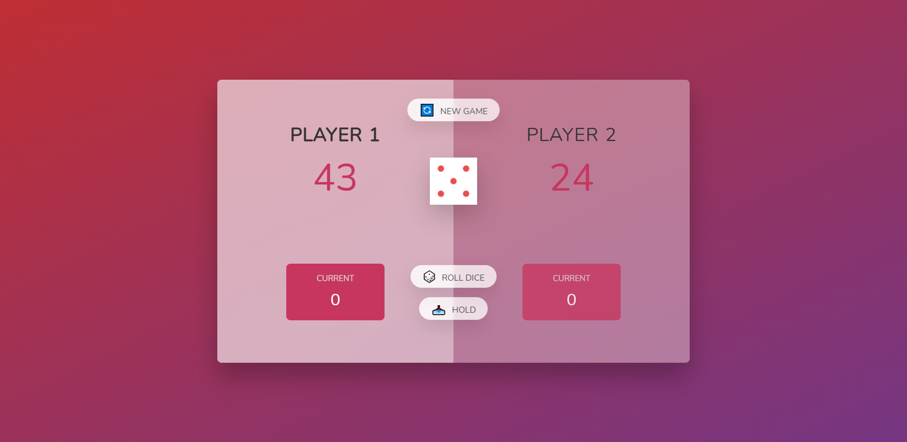

# 🐷 Pig Game

Pig is a simple dice game. Players take turns to roll a single die as many times as they wish, adding all roll results to a running total, but losing their gained score for the turn if they roll a 1.

Each turn, a player repeatedly rolls a die until either a 1 is rolled or the player decides to "hold":

* If the player rolls a 1, they score nothing and it becomes the next player's turn.
* If the player rolls any other number, it is added to their turn total and the player's turn continues.
* If a player chooses to "hold", their turn total is added to their score, and it becomes the next player's turn.
* The first player to score 100 or more points wins.

For example, the first player, Jennifer, begins a turn with a roll of 5. Jennifer could hold and score 5 points, but chooses to roll again. Jennifer rolls a 2, and could hold with a turn total of 7 points, but chooses to roll again. Jennifer rolls a 1, and must end her turn without scoring. The next player, Luis, rolls the sequence 4-5-3-5-5, after which he chooses to hold, and adds his turn total of 22 points to his score.

## Table of Contents
* [Deployment](#deployment)
* [Built With](#built-with)
* [Authors](#authors)
* [License](#license)
* [Acknowledgements](#acknowledgement)

 
## Deployment

Deployed Website: https://rosajen27.github.io/pig/

## Built With

* HTML
* CSS
* JavaScript

## Authors

  - **Jennifer Rosa**
    [Rosajen27](https://rosajen27.github.io/)

## License

This project is licensed under the MIT License.

Copyright (c) 2021 Jennifer Rosa

Permission is hereby granted, free of charge, to any person obtaining a copy
of this software and associated documentation files (the "Software"), to deal
in the Software without restriction, including without limitation the rights
to use, copy, modify, merge, publish, distribute, sublicense, and/or sell
copies of the Software, and to permit persons to whom the Software is
furnished to do so, subject to the following conditions:

The above copyright notice and this permission notice shall be included in all
copies or substantial portions of the Software.

THE SOFTWARE IS PROVIDED "AS IS", WITHOUT WARRANTY OF ANY KIND, EXPRESS OR
IMPLIED, INCLUDING BUT NOT LIMITED TO THE WARRANTIES OF MERCHANTABILITY,
FITNESS FOR A PARTICULAR PURPOSE AND NONINFRINGEMENT. IN NO EVENT SHALL THE
AUTHORS OR COPYRIGHT HOLDERS BE LIABLE FOR ANY CLAIM, DAMAGES OR OTHER
LIABILITY, WHETHER IN AN ACTION OF CONTRACT, TORT OR OTHERWISE, ARISING FROM,
OUT OF OR IN CONNECTION WITH THE SOFTWARE OR THE USE OR OTHER DEALINGS IN THE
SOFTWARE.

## Acknowledgements

* The Complete JavaScript Course 2021: From Zero to Expert!